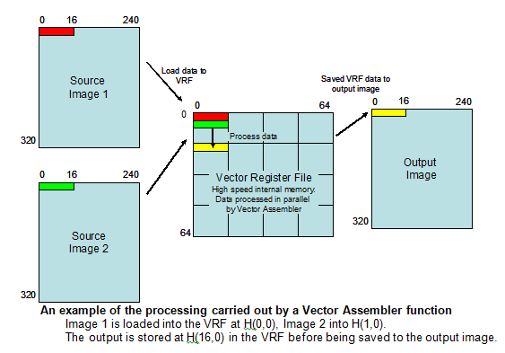
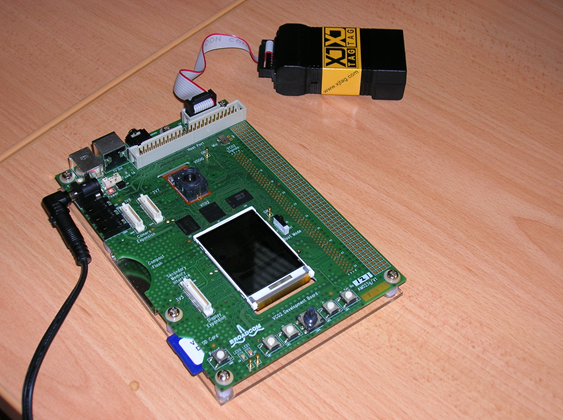
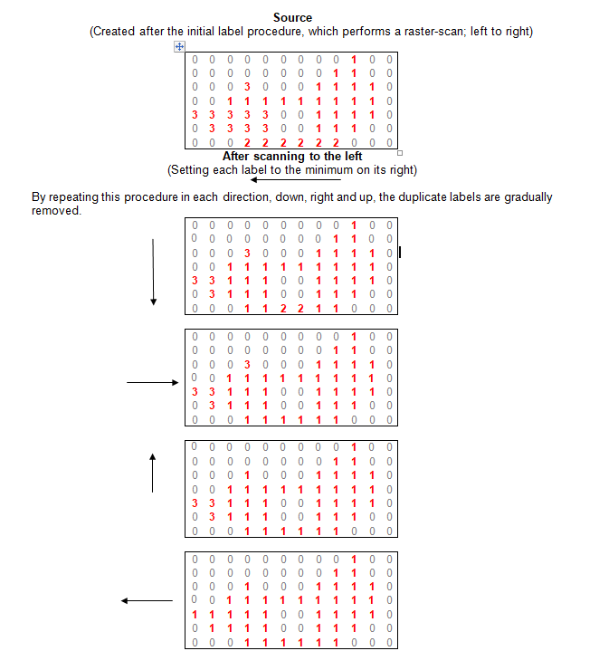
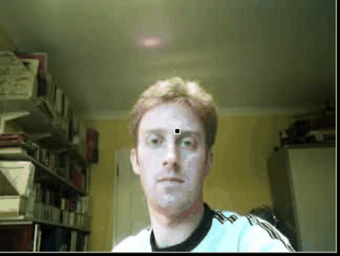

# Masters in Real-Time Embedded Computer Vision

## York University

## Summary 
This project explored whether core computer vision algorithms could run efficiently on a very low-power embedded DSP — specifically the Broadcom VideoCore, which was used in devices like the iPod Video.

I researched academic papers, selected a set of classic vision techniques, and reimplemented them entirely in vector assembler to make use of the SIMD instruction set, achieving up to 50× performance gains compared to equivalent C code running on the main processor. 

Nowadays, SIMD operations are often wrapped in libraries or frameworks like CUDA, OpenCL, Intel Intrinsics, or ARM NEON, where you get structured access to parallelism. But back then, I had to do it all directly in vector assembler, writing explicit instructions to load data, operate in parallel across lanes, and extract results manually. The overall pattern was familiar: *load → compute → store* but at the lowest level.

I developed a small, highly optimized library of computer vision functions including:

- Frame differencing
- Thresholding
- Morphological operations
- Connected Component Labelling (the most complex)

The work demonstrated that meaningful image processing pipelines could run in real time on low-power embedded systems.

👉 [Source Code](source/cv_library.asm)

## Connected Component Labelling (CCL)

One of the pieces I’m proudest of from this MSc was a connected component labelling algorithm I wrote in assembler for a DSP. It ran in real time thanks to the SIMD architecture — even though it involved multiple image scans.

The algorithm used a novel approach that scanned across the image in a raster pass, copying the minimum label value to resolve equivalences instead of relying on union-find structures. This made it compact, fast, and ideal for the constrained memory and processing available on the Broadcom chip.

Here's a static explanation showing how the labels are resolved through repeated raster-style passes in each direction:

The approach avoids the need for a union-find structure by propagating the minimum label across connected pixels — compact, efficient, and perfect for SIMD.

## Side project - Pong!

I thought it would be interesting to put together a small game using my assembler DSP comptuer vision library. I chose the classic pong. 

Is uesed:
- Real-time frame differencing and morphological filters
- Code written in **vector assembler**
- Careful optimization to run on a constrained DSP + microprocessor
- Hand tracking based on motion within screen-edge regions

I thought it would be interesting to recreate it in a browser with some help from chatgpt.

A hand-tracked version of Pong that runs entirely in the browser using your webcam and MediaPipe Hands. Control the paddles with your bare hands.

##  Modern Version - HTML5/MediaPipe/JavaScript - Play it live!

Click below to have a go! 

👉 [https://robbypee.github.io/hand-pong](https://robbypee.github.io/hand-pong)

- Hold your hands near the **left and right screen edges** to move the paddles
- Hit the ball back and forth — each hit scores a point
- Missing the ball shows a "Game Over" message with a countdown to restart

This version uses:
- **MediaPipe Hands** for real-time hand landmark detection
- **HTML5 Canvas** for paddle and ball rendering
- JavaScript to handle game logic, scoring, and restart flow

Built with AI support (ChatGPT) to help retranslate the embedded concept into modern browser code... a modern interpretation of the original implementation. 

---

## 📄 License

MIT — free to use, build on, or modify.

---

