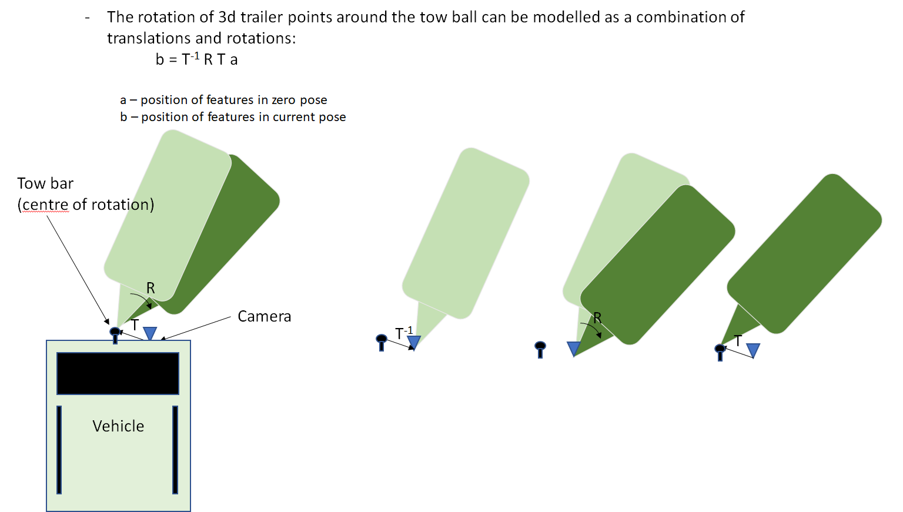
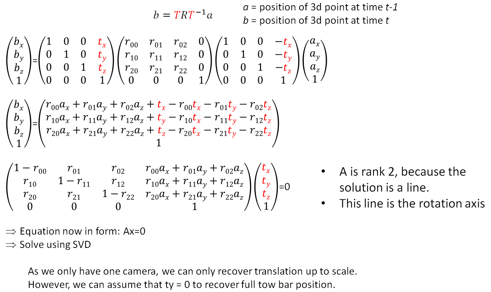
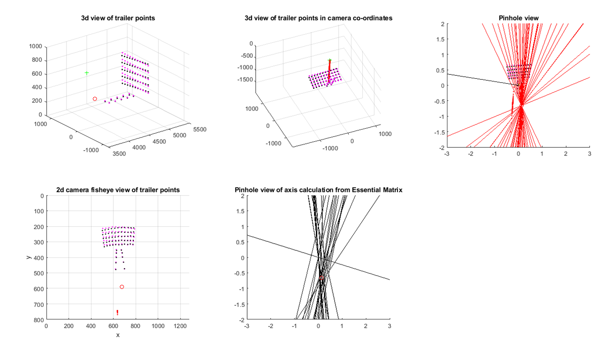

# Tow Hitch Position Estimation via Structure from Motion (SfM)

**Patent:** US 11,407,363 B2**Inventor:** Robin Plowman**Company:** Continental AG**Filed:** During employment at Continental as part of the trailer reverse assist project

---

## Overview

This work was part of a broader **trailer reverse assist system**, enabling a vehicle to automatically steer while reversing with a trailer. One critical component of this system is **determining the location of the tow hitch (towball)** relative to the vehicle using only a rear-facing camera.

This specific technique enables **vision-based towball localization** using a monocular camera through **Structure from Motion (SfM)** principles.

---

## Problem Statement

Given a **rear-facing camera mounted on a vehicle**, estimate the **3D position of the towball** without requiring specialized hardware or manual measurement. This allows trailer geometry and dynamics to be inferred for further use in path planning and steering control.

---

## Core Idea

1. **Camera Calibration**   The camera must be calibrated:

   - **Intrinsic parameters**: focal length, principal point, lens distortion — map camera rays to pixels.
   - **Extrinsic parameters**: map camera coordinates to vehicle coordinates.

   This provides a **1-to-1 mapping** from image pixels to rays in vehicle space.

2. **Track Image Features on the Trailer**   Use standard feature detection (e.g., optical flow, KLT) to track trailer features over time.

3. **Estimate 3D Pose of the Trailer (R, t)**   With feature tracks, estimate the **rotation (R)** and **translation (t)** of the trailer in vehicle space at each frame.

4. **Compute the Trailer's Instantaneous Rotation Axis**   Any rigid motion can be represented as a **rotation around an axis in 3D** (via screw theory).

5. **Towball Location = Intersection of Rotation Axes**   Over time, the trailer rotates around the **virtual towball joint**. By computing multiple axes of rotation, the towball lies on their **intersection line** — a ray from the camera to the towball.

6. **Scale Recovery**   The method estimates a **directional ray**, not a full 3D position. However, with additional constraints (e.g., known drawbar length, trailer geometry), full 3D recovery is possible.

---

## Significance

- **No need for accurate measurement of cars tow ball (suits aftermarket towballs, hitch extenders, or variable position tow balls)**
- Leads to accurate path planning
- Visualisations appear accurate to drivers
- Fully vision-based and passive
- Enables downstream trailer control algorithms to operate safely and robustly

---

## My Contribution

- Conceived the original idea and approach
- Prototyped the system using Structure from Motion principles
- Developed and deployed **real-time embedded C++ code**
- Verified performance in **on-road vehicle testing**

---

## Patent Link

[Google Patents – US11407363B2](https://patents.google.com/patent/US11407363B2/en)

---

## Contact

This project was created during my time at Continental. For any personal inquiries, reach out via [GitHub](https://github.com/your-username) or connect on LinkedIn.
