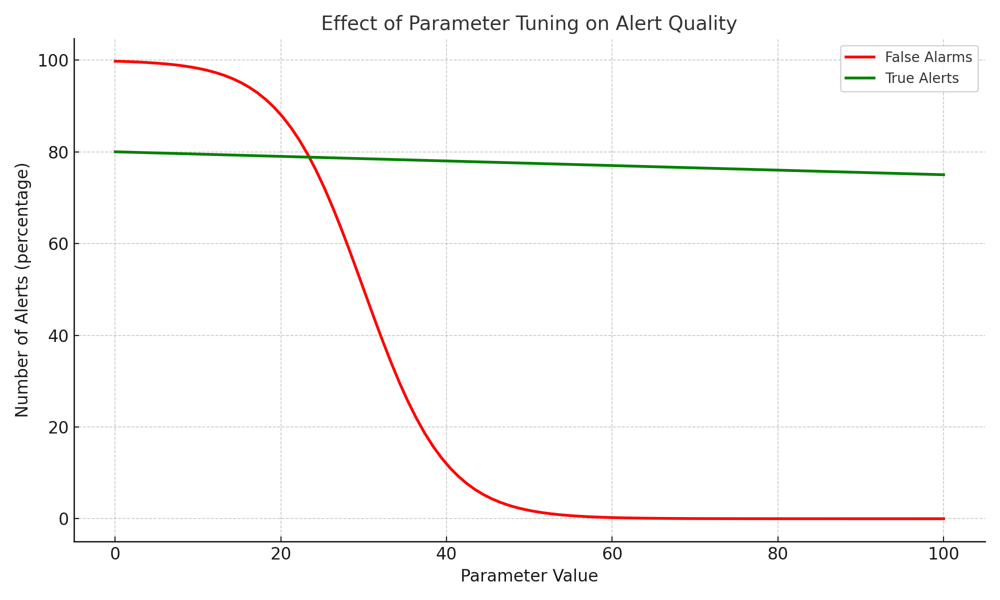

# Robin Plowman

*Developer · R\&D Engineer · Data Explorer · Visual Thinker*

I started out writing games and tools like a scientific calculator as a teenager, then went on to study Mathematics at the University of Warwick. That grounding in logic, structure, and problem-solving continues to shape how I approach everything from embedded systems to AI-powered simulations.

I'm a technical generalist with a strong track record of solving real-world problems, from embedded firmware and multi-threaded C++ systems to data-driven analysis of complex system failures. My background spans computer vision, 3D geometry, classical mathematics, and more recently, LLMs and agent-based architectures. I’ve worked across R&D and production in domains like ADAS, education tooling, and patent strategy, always aiming to build systems that are both useful and original.

  

  

    
I love to build visual tools to explain and debug: animated plots, overlaid video, interactive simulations, and even dynamic Excel sheets. Good visuals don't just communicate, they hook people in, create alignment, and make technical work human.

    
My goal is usually to make people ask <i>What if ....?</i>

  

  

This page showcases a selection of my work, some completed, some ongoing, and some still taking shape. From embedded trailer assist systems to live LEGO-to-game reconstruction and interpretable agent-based LLM societies.

Links
- [Real-Time Embedded Computer Vision Msc](Msc.md)
- [Playable version of Computer Vision Pong (enable your webcam!)](source/HandPong.html)
- [Patent explainer](Tow_Hitch_Position_Estimation_SfM.md)

## Philosophy

I try to build tools that are:

* **Local-first** : They run on your machine, not someone else's server
* **Subscription-free** : No recurring fees, no account needed
* **Open-source** : Inspect, learn from, and modify the code
* **Owned by the user** : Data stays private, workflows stay portable

This matters especially for schools, small businesses, or families who need reliable software without signing up to the expensive subscriptions. It also solves problems with data ownership, like GDPR.

Whenever possible, I use lightweight models like Phi-3 or MediaPipe, served locally with no tracking or external dependencies.

## Projects (Ongoing)

*Exploring real-world use cases amid the AI hype.*

### Local LLM Assistant for my partners business (Lingotots)
- LLM-powered (Phi-3) local tool that saves hours of admin time
- Interfaces with existing tech (Google Business Suite in this case). Accesses calendars, club rosters, school websites and uses RAG to present a summary of emails. 
- Lists of emails recieved with suggested replies
- Producing attedance sheet with lists of pick up times
- Demo includes human-in-the-loop interface, brand-consistent auto-replies, and modular Google Apps Script integration

GDPR compliant and reistant to prompt injection. 
Runs entirely locally on a laptop in the office.

### LEGO CV + Game Engine
- Top Secret for now, I need to explore IP protection!

### LLM evolution

Inspired by human cultural evolution and cognitive specialization. Does cooperation between specialised agents lead to a Theory of Mind? What emergent behaviours appear?

- A simulated society of LLM agents evolving language, roles, and memory
- Built for interpretability, with a dedicated “interpreter agent” preserving human readability
- Goal: Explore emergence of social structure, language drift, and role-based proto-cultures

### Large Scale Software Development with Local LLMs
How can we solve the problem of llms developing large software codebases with limited context sizes?

Answer - break the problem down, repeatedly. One LLM per class with clear interfaces. Parallelizable and scalable.

- Autonomous agent network where each agent represents a code class
- Agents handle test writing, implementation, documentation, and prompt self-updating
- Periodic summarization reduces context window usage and improves abstraction
- Graph grows over time with agent spawns for subclasses and merges
- Early target: solving TSP or simulation problems with 3–5 class hierarchies

### Numerous DIY projects too!
- must finish tiling the bathroom...

---

## Skills

* **Languages**: C++ (11–20), Python, MATLAB, VBA, ARM Assembler
* **Domains**: Computer Vision, 3D Geometry Embedded Systems, Real-Time Control, Optimisation, SLAM/SfM, Neural Networks, Patent Analysis
* **Tools**: Git, Azure DevOps, CI/CD, Qt, ZeroMQ, TensorFlow, ONNX, Intel TBB
* **Concepts**: Structure from Motion, Kalman Filtering, 3D Geometry, Control Theory, Statistical Analysis, CI/Test Automation

---

## Work History

* **Microsoft** – Built perception APIs combining audio, vision, and language models for Windows and Devices.
* **Sony Hawkeye** – Developed 3D vision and AI tools for sports analysis broadcast systems.
* **Continental** – Created embedded ADAS features including trailer assist; filed multiple patents.
* **Thales** – Developed threat detection algorithms for IR tracking systems.
* **Legal & General** – Built cloud tools for actuaries using Python and Azure.
* **Patent Attorney (Venner Shipley)** – Drafted and prosecuted electronics patents for global clients.
* **Fidessa / Edwards / OCCAM** – Various C++ infrastructure and modelling roles in finance and motor control.

---

## Education

* **MSc** in Real-Time Embedded Computer Vision – University of York
* **BSc** in Mathematics – University of Warwick
* **PGCert** in Intellectual Property Law – Queen Mary University London

## Patents

* [**US 11,407,363 B2**](Tow_Hitch_Position_Estimation_SfM)[ – ](Tow_Hitch_Position_Estimation_SfM)[*Tow Hitch Position Estimation via SfM*](Tow_Hitch_Position_Estimation_SfM)[ - click for an explanation!](Tow_Hitch_Position_Estimation_SfM)
* **US 10,964,059 B2** – *Static Camera Calibration from Vehicle Motion*
* **US 10,832,428 B2** – *Range Estimation of Moving Object*
* **US 12,227,042 B2** – *Calculating Vehicle Trailer Angle*

